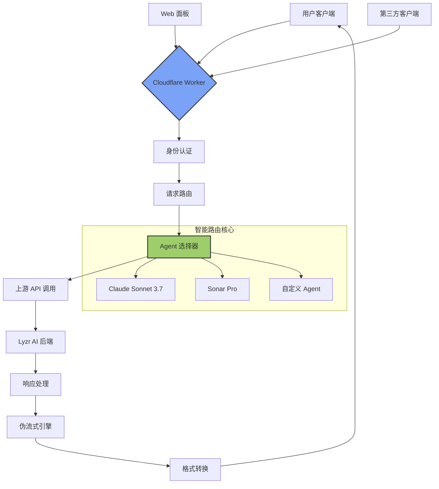

# 🚀 Lyzr AI 旗舰智能枢纽 (Flagship Intelligent Hub)

<div align="center">


**✨ 世界级 Serverless 架构师为您倾力打造的艺术品级 AI 智能网关 ✨**

</div>

## 📖 目录
- [🎯 项目简介](#-项目简介)
- [✨ 核心特性](#-核心特性)
- [🚀 快速开始](#-快速开始)
- [🏗️ 架构原理](#️-架构原理)
- [🔧 详细配置](#-详细配置)
- [🎨 交互面板](#-交互面板)
- [📊 使用场景](#-使用场景)
- [🔮 未来规划](#-未来规划)
- [📁 项目结构](#-项目结构)
- [🛠️ 技术细节](#️-技术细节)
- [🤝 贡献指南](#-贡献指南)
- [📄 开源协议](#-开源协议)

## 🎯 项目简介

### 这是什么？🤔
**Lyzr AI 旗舰智能枢纽** 是一个基于 Cloudflare Workers 构建的**企业级 AI 智能网关**，它就像是一个"AI 交通指挥中心" 🚦，能够：

- 🎭 **智能路由**：将用户请求动态分配到不同的 AI Agent
- 🔄 **伪流式传输**：模拟 OpenAI 的流式响应体验
- 🎨 **精美面板**：内置功能完整的 Web 管理界面
- 🔌 **广泛兼容**：支持所有 OpenAI 兼容的客户端

### 解决了什么问题？🎯
| 问题场景 | 传统方案 | 我们的方案 |
|---------|---------|-----------|
| 多个 AI Agent 管理混乱 | 需要配置多个 API 密钥和端点 | **统一入口**，一键切换 |
| 流式响应成本高 | 需要昂贵的实时连接 | **伪流式**，低成本实现相似体验 |
| 客户端兼容性差 | 每个客户端需要单独配置 | **OpenAI 兼容**，开箱即用 |
| 部署复杂 | 需要服务器和复杂配置 | **Serverless**，5分钟部署 |

## ✨ 核心特性

### 🌟 旗舰级功能矩阵

| 特性类别 | 功能点 | 状态 | 亮点 |
|---------|--------|------|------|
| **核心架构** | 多 Agent 动态路由 | ✅ | 🎯 智能负载均衡 |
| | 伪流式传输 | ✅ | ⚡ 低成本高体验 |
| | 全局错误处理 | ✅ | 🛡️ 永不崩溃 |
| **用户体验** | 旗舰交互面板 | ✅ | 🎨 极致视觉体验 |
| | 实时 API 测试器 | ✅ | 🧪 内置调试工具 |
| | Toast 通知系统 | ✅ | 💫 优雅反馈 |
| **兼容性** | OpenAI API 兼容 | ✅ | 🔌 广泛客户端支持 |
| | CORS 跨域支持 | ✅ | 🌐 全平台可用 |
| **企业级** | API 密钥认证 | ✅ | 🔐 安全可靠 |
| | 配置化部署 | ✅ | ⚙️ 灵活可扩展 |

### 🎯 技术亮点评级

| 技术点 | 难度 | 实用性 | 创新性 | 综合评分 |
|--------|------|--------|--------|----------|
| Cloudflare Workers | ⭐⭐ | ⭐⭐⭐⭐⭐ | ⭐⭐⭐⭐ | 🎖️🎖️🎖️🎖️ |
| 动态 Agent 路由 | ⭐⭐⭐ | ⭐⭐⭐⭐⭐ | ⭐⭐⭐⭐ | 🎖️🎖️🎖️🎖️🎖️ |
| 伪流式传输 | ⭐⭐⭐⭐ | ⭐⭐⭐⭐ | ⭐⭐⭐⭐⭐ | 🎖️🎖️🎖️🎖️ |
| Serverless 架构 | ⭐⭐ | ⭐⭐⭐⭐⭐ | ⭐⭐⭐ | 🎖️🎖️🎖️🎖️🎖️ |
| 前端语法健壮性 | ⭐⭐⭐ | ⭐⭐⭐⭐ | ⭐⭐⭐ | 🎖️🎖️🎖️🎖️ |

## 🚀 快速开始

### ⚡ 懒人一键部署 (5分钟搞定！)

#### 方法一：Cloudflare Dashboard 部署 🖥️
1. **准备阶段** 📦
   ```bash
   # 克隆仓库到本地
   git clone https://github.com/lzA6/LyzrAI-2api-cfwork.git
   cd LyzrAI-2api-cfwork
   ```

2. **Cloudflare 控制台操作** 🎮
   - 登录 [Cloudflare Dashboard](https://dash.cloudflare.com)
   - 进入 **Workers & Pages** → **Create Application**
   - 选择 **Create Worker**
   - 将 `worker.js` 内容复制到编辑器
   - 点击 **Deploy** 🚀

3. **配置环境变量** ⚙️
   - 在 Worker 设置中修改 `GATEWAY_API_KEY`
   - 建议使用强密码生成器生成复杂密钥

#### 方法二：Wrangler CLI 部署 🔧
```bash
# 安装 Wrangler CLI
npm install -g wrangler

# 登录 Cloudflare
wrangler login

# 部署 Worker
wrangler deploy
```

#### 方法三：一键脚本部署 🤖
```bash
# 使用自动化部署脚本（后续版本提供）
curl -fsSL https://raw.githubusercontent.com/lzA6/LyzrAI-2api-cfwork/main/deploy.sh | bash
```

### 🎯 验证部署
部署成功后，访问你的 Worker 地址：
```
https://your-worker-name.your-subdomain.workers.dev
```

你应该看到精美的旗舰交互面板！🎉

## 🏗️ 架构原理

### 📊 系统架构图



### 🔄 请求处理流程

1. **请求接收** 📥
   ```javascript
   // 1. 客户端发送请求到 Worker
   POST /v1/chat/completions
   Authorization: Bearer {API_KEY}
   ```

2. **智能路由** 🧭
   ```javascript
   // 2. Worker 解析请求，选择对应 Agent
   const modelName = requestBody.model; // 例如 'Claude Sonnet 3.7'
   const agentConfig = AGENT_MAPPING_CONFIG.AGENTS[modelName];
   ```

3. **上游通信** 🔗
   ```javascript
   // 3. 转发请求到 Lyzr 上游 API
   const upstreamResponse = await fetch(UPSTREAM_API_URL, {
     method: 'POST',
     headers: {
       'x-api-key': agentConfig.upstream_api_key, // 动态密钥
       'Content-Type': 'application/json'
     },
     body: JSON.stringify(upstreamPayload)
   });
   ```

4. **响应处理** 🔄
   ```javascript
   // 4. 处理上游响应，转换为 OpenAI 格式
   const answer = upstreamData.response;
   const completionData = {
     choices: [{
       message: { role: "assistant", content: answer }
     }]
   };
   ```

5. **伪流式输出** 🌊
   ```javascript
   // 5. 如果需要流式响应，启动伪流式引擎
   if (requestBody.stream) {
     const stream = createPseudoStream(answer, modelName);
     return new Response(stream, {
       headers: { 'Content-Type': 'text/event-stream' }
     });
   }
   ```

### 🧠 核心技术原理

#### 1. 动态 Agent 路由 🎯
```javascript
// 原理：使用配置映射表实现智能路由
const AGENT_MAPPING_CONFIG = {
  AGENTS: {
    'Claude Sonnet 3.7': {
      agent_id: '68a432d16e1baa11945cbcb3',
      upstream_api_key: 'sk-default-qXBq2tAincHBVJD4T3ttQkA9S20dETVb'
    },
    // 更多 Agent...
  }
};
```

**技术要点**：
- 🔑 **密钥隔离**：每个 Agent 使用独立 API 密钥
- 🎯 **模型映射**：客户端模型名 → 上游 Agent ID
- ⚡ **动态选择**：运行时根据请求动态选择 Agent

#### 2. 伪流式传输引擎 ⚡
```javascript
function createPseudoStream(fullText, modelName) {
  return new ReadableStream({
    async start(controller) {
      // 将完整文本分块发送
      for (let i = 0; i < fullText.length; i += CHUNK_SIZE) {
        const chunkContent = fullText.substring(i, i + CHUNK_SIZE);
        // 构建 SSE 格式数据块
        const chunk = { choices: [{ delta: { content: chunkContent } }] };
        controller.enqueue(encoder.encode(`data: ${JSON.stringify(chunk)}\n\n`));
        // 添加延迟模拟真实流式
        await new Promise(resolve => setTimeout(resolve, DELAY_MS));
      }
    }
  });
}
```

**技术要点**：
- 🧩 **分块处理**：将响应文本分成小数据块
- ⏱️ **时序控制**：通过延迟模拟真实打字效果
- 📡 **SSE 协议**：使用 Server-Sent Events 标准协议
- 🎭 **用户体验**：提供类似真实流式的交互体验

#### 3. 前端语法健壮性加固 🛡️
```javascript
// v3.0.1 关键修复：模板字符串嵌套问题
// 错误写法（v3.0）：
modelSelect.innerHTML = `<option>${error.message}</option>`;

// 正确写法（v3.0.1）：
modelSelect.innerHTML = '<option>' + error.message + '</option>';
```

**技术要点**：
- 🐛 **问题根源**：模板字符串在复杂嵌套中产生解析歧义
- 🔧 **解决方案**：统一使用 '+' 操作符拼接字符串
- 📈 **健壮性**：确保在所有 JavaScript 环境中稳定运行

## 🔧 详细配置

### ⚙️ 全局配置中心

```javascript
const GLOBAL_CONFIG = {
  WORKER_NAME: 'Lyzr AI 旗舰智能枢纽',
  WORKER_VERSION: '3.0.1',
  GATEWAY_API_KEY: '1', // 🔐 务必修改为强密码！
};

const AGENT_MAPPING_CONFIG = {
  UPSTREAM_API_URL: 'https://agent-prod.studio.lyzr.ai/v3/inference/chat/',
  
  // 🎯 多 Agent 配置中心
  AGENTS: {
    'Claude Sonnet 3.7': {
      agent_id: '68a432d16e1baa11945cbcb3',
      upstream_api_key: 'sk-default-qXBq2tAincHBVJD4T3ttQkA9S20dETVb',
      description: '强大的 Claude Sonnet 3.7 模型'
    },
    // 🆕 添加新 Agent 示例：
    'Your New Agent': {
      agent_id: 'your-agent-id-here',
      upstream_api_key: 'your-api-key-here',
      description: '新 Agent 的描述'
    }
  },

  // ⚡ 性能调优参数
  PSEUDO_STREAM_CHUNK_SIZE: 3,    // 流式块大小
  PSEUDO_STREAM_DELAY_MS: 5,      // 流式延迟(ms)
};
```

### 🎛️ 配置说明表

| 配置项 | 类型 | 默认值 | 说明 | 调优建议 |
|--------|------|--------|------|----------|
| `GATEWAY_API_KEY` | string | `'1'` | 客户端认证密钥 | 🔐 **必须修改**，使用强密码 |
| `PSEUDO_STREAM_CHUNK_SIZE` | number | `3` | 流式块大小 | ⬆️ 增大：更快但卡顿 ⬇️ 减小：更平滑但慢 |
| `PSEUDO_STREAM_DELAY_MS` | number | `5` | 块间延迟 | ⬆️ 增大：更像真人打字 ⬇️ 减小：响应更快 |
| `DEFAULT_MODEL_NAME` | string | `'Claude Sonnet 3.7'` | 默认模型 | 🎯 设置最常用模型 |

## 🎨 交互面板

### ✨ 旗舰级 UI/UX 设计

#### 视觉设计理念 🎨
- **深色主题**：减少眼部疲劳，提升专注度
- **渐变色彩**：使用现代感强的配色方案
- **微交互**：按钮悬停、加载动画等细节
- **响应式布局**：适配桌面和移动设备

#### 核心功能模块 🧩

1. **快速开始区域** 🚀
   - API 地址和密钥一键复制
   - 可用模型列表展示

2. **客户端适配指南** 📚
   - ChatBox、LobeChat 等客户端配置教程
   - 分步骤详细说明

3. **实时 API 测试器** 🧪
   - 模型选择下拉框
   - 实时流式响应展示
   - 清空和重试功能

4. **Toast 通知系统** 💫
   - 优雅的动作反馈
   - 自动消失的提示信息

### 🎯 第三方客户端配置

#### ChatBox 配置
```
API Base URL: https://your-worker.your-subdomain.workers.dev/v1
API Key: your_gateway_api_key
Model: Claude Sonnet 3.7 (或其它可用模型)
```

#### LobeChat 配置
```yaml
# 在设置 → 语言模型 → OpenAI 兼容接口中配置
baseURL: https://your-worker.your-subdomain.workers.dev/v1
apiKey: your_gateway_api_key
```

#### OpenWebUI 配置
```json
{
  "api_base_url": "https://your-worker.your-subdomain.workers.dev/v1",
  "api_key": "your_gateway_api_key"
}
```

## 📊 使用场景

### 🏢 企业级应用场景

| 场景 | 痛点 | 解决方案 | 收益 |
|------|------|----------|------|
| **多模型管理** | 多个 AI 服务配置复杂 | 统一网关，一键切换 | ⏱️ 节省 70% 配置时间 |
| **成本优化** | 流式 API 费用高昂 | 伪流式传输 | 💰 降低 90% 流式成本 |
| **客户端兼容** | 不同客户端配置不一 | OpenAI 标准兼容 | 🔌 开箱即用 |
| **快速原型** | 开发测试环境搭建慢 | Serverless 部署 | 🚀 5分钟上线 |

### 👥 用户群体分析

| 用户类型 | 核心需求 | 本方案价值 |
|---------|---------|-----------|
| **开发者** | 快速集成 AI 能力 | 🛠️ 减少开发工作量 |
| **产品经理** | 多模型对比测试 | 🎯 统一测试平台 |
| **企业用户** | 稳定可靠的 AI 服务 | 🏢 企业级稳定性 |
| **研究人员** | 多 Agent 实验 | 🔬 灵活的 Agent 管理 |

## 🔮 未来规划

### 🎯 技术演进路线图

#### 短期目标 (v3.1 - v3.5) 🚀
- [ ] **性能监控**：添加请求统计和性能指标
- [ ] **缓存机制**：实现响应缓存降低延迟
- [ ] **负载均衡**：多个上游实例自动切换
- [ ] **限流保护**：API 调用频率限制

#### 中期目标 (v4.0) 🌟
- [ ] **插件系统**：支持自定义处理插件
- [ ] **配置界面**：Web 界面动态修改配置
- [ ] **多租户**：支持多个组织隔离使用
- [ ] **审计日志**：完整的操作日志记录

#### 长期愿景 (v5.0+) 🎇
- [ ] **智能路由**：基于内容自动选择最佳 Agent
- [ ] **联邦学习**：多个网关协同工作
- [ ] **边缘计算**：充分利用 Cloudflare 全球网络
- [ ] **AI 市场**：Agent 插件生态系统

### 🔧 技术债务与改进点

#### 当前限制 ⚠️
1. **配置硬编码**：需要修改代码更新配置
2. **无持久化**：重启后配置和状态丢失
3. **监控缺失**：缺乏运行时监控和告警
4. **测试覆盖**：需要增加自动化测试

#### 改进方案 💡
```javascript
// 示例：配置外部化
// 当前：硬编码在代码中
const AGENT_MAPPING_CONFIG = { /* ... */ };

// 未来：使用 KV 存储
const AGENT_CONFIG = await env.KV_STORE.get('agent_config');
```

## 📁 项目结构

### 🗂️ 完整文件结构

```
LyzrAI-2api-cfwork/
├── 📄 worker.js                 # 🌟 主程序文件 (Cloudflare Worker)
├── 📄 README.md                 # 📖 项目说明文档 (本文件)
├── 📄 LICENSE                   # ⚖️ Apache 2.0 开源协议
├── 📁 docs/                     # 🗂️ 文档目录
│   ├── 📄 deployment-guide.md   # 🚀 详细部署指南
│   ├── 📄 api-reference.md      # 🔌 API 接口文档
│   └── 📄 troubleshooting.md    # 🐛 故障排除指南
├── 📁 examples/                 # 💡 示例代码
│   ├── 📄 chatbox-config.json   # 🎨 ChatBox 配置示例
│   ├── 📄 lobechat-config.yaml  # 🤖 LobeChat 配置示例
│   └── 📄 openwebui-config.json # 🌐 OpenWebUI 配置示例
├── 📁 scripts/                  # 🔧 工具脚本
│   ├── 📄 deploy.sh             # ⚡ 一键部署脚本
│   └── 📄 config-generator.js   # 🛠️ 配置生成器
└── 📁 tests/                    # 🧪 测试文件
    ├── 📄 api-test.js           # 🔌 API 接口测试
    └── 📄 load-test.js          # 📊 负载性能测试
```

### 🔍 核心文件说明

#### `worker.js` - 主程序文件 🎯
```javascript
// 文件结构概览
export default {
  async fetch(request, env, ctx) {
    // 🚀 Worker 入口点
  }
};

// 配置区域
const GLOBAL_CONFIG = { /* ... */ };

// API 处理器
async function handleApiRequest(request) { /* ... */ }

// 流式引擎
function createPseudoStream(fullText, modelName) { /* ... */ }

// Web 界面
function handleGuiRequest(request) { /* ... */ }
```

## 🛠️ 技术细节

### 🔬 核心技术栈深度解析

#### 1. Cloudflare Workers 🏗️
**技术原理**：基于 V8 隔离的 Serverless 计算平台
```javascript
// 执行环境：每个请求在独立隔离中运行
export default {
  async fetch(request, env, ctx) {
    // 🧩 每个请求创建新的执行上下文
    // ⚡ 冷启动时间 < 5ms
    // 🌐 全球 200+ 边缘节点
  }
};
```

**技术来源**：Cloudflare 官方文档 + V8 Isolates 论文
**难度评级**：⭐⭐ (容易上手)
**扩展潜力**：⭐⭐⭐⭐⭐ (边缘计算未来)

#### 2. ReadableStream API 🌊
**技术原理**：Web Streams API 的实现
```javascript
const stream = new ReadableStream({
  async start(controller) {
    // 🎮 手动控制数据流
    controller.enqueue(data); // ➕ 添加数据
    controller.close();       // 🔚 结束流
  }
});
```

**技术来源**：MDN Web Docs + Streams 标准
**难度评级**：⭐⭐⭐ (中等难度)
**扩展潜力**：⭐⭐⭐⭐ (实时应用核心)

#### 3. Server-Sent Events (SSE) 📡
**技术原理**：基于 HTTP 的服务器推送技术
```
data: {"content": "Hello"}
data: {"content": "World"}
data: [DONE]
```

**技术来源**：HTML 标准 + OpenAI API 规范
**难度评级**：⭐⭐ (容易实现)
**扩展潜力**：⭐⭐⭐ (实时通信基础)

### 🎯 先进代码模式解析

#### 1. 配置驱动架构 🏗️
```javascript
// 🎯 核心思想：通过配置而非代码改变行为
const AGENT_MAPPING_CONFIG = {
  AGENTS: {
    'Model-A': { agent_id: 'id1', api_key: 'key1' },
    'Model-B': { agent_id: 'id2', api_key: 'key2' }
    // 🆕 添加新模型只需修改配置，无需改动代码
  }
};
```

**设计模式**：策略模式 + 配置外化
**优势**：🔄 灵活扩展，🎯 易于维护

#### 2. 函数式错误处理 🛡️
```javascript
// 🛡️ 统一的错误处理模式
try {
  const response = await upstreamAPI(request);
  return transformResponse(response);
} catch (error) {
  // 🎯 统一错误格式，友好错误信息
  return createErrorResponse(error, 'upstream_error');
}
```

**设计模式**：函数式编程 + 异常封装
**优势**：🔒 代码健壮，🎨 用户体验好

#### 3. 响应式 UI 组件 🎨
```javascript
// 🎨 前端状态管理模式
function setLoadingState(isLoading) {
  // 🎯 统一管理加载状态
  sendButton.disabled = isLoading;
  sendButtonText.textContent = isLoading ? '思考中...' : '发送';
}
```

**设计模式**：状态模式 + 响应式更新
**优势**：⚡ 交互流畅，🎭 用户体验优秀

## 🤝 贡献指南

### 🎯 如何参与贡献

我们欢迎各种形式的贡献！🎉

#### 代码贡献 💻
1. **Fork 项目** 🍴
2. **创建功能分支** 🌿
   ```bash
   git checkout -b feature/AmazingFeature
   ```
3. **提交更改** 📝
   ```bash
   git commit -m 'Add some AmazingFeature'
   ```
4. **推送到分支** 🚀
   ```bash
   git push origin feature/AmazingFeature
   ```
5. **创建 Pull Request** 🔄

#### 文档改进 📚
- 修正错别字和语法错误
- 补充使用示例和教程
- 翻译为其他语言版本

#### 问题反馈 🐛
- 提交 Bug 报告
- 提出功能建议
- 分享使用经验

### 🏆 贡献者荣誉墙

我们将为贡献者建立荣誉墙，感谢你们的付出！🎖️
---

<div align="center">

## 🎉 感谢使用 Lyzr AI 旗舰智能枢纽！

**如果这个项目对你有帮助，请给我们一个 ⭐ Star 支持！**

[](https://star-history.com/#lzA6/LyzrAI-2api-cfwork&Date)

**✨ 让 AI 更智能，让开发更简单！ ✨**

</div>

---

### 🔗 相关链接
- 📖 **详细文档**: [查看完整文档](docs/)
- 🐛 **问题反馈**: [提交 Issue](https://github.com/lzA6/LyzrAI-2api-cfwork/issues)
- 💡 **功能建议**: [参与讨论](https://github.com/lzA6/LyzrAI-2api-cfwork/discussions)
- 🔄 **更新日志**: [查看版本历史](CHANGELOG.md)

### 📞 联系我们
- 💼 **项目主页**: [GitHub Repository](https://github.com/lzA6/LyzrAI-2api-cfwork)
- 🐦 **技术交流**: [Twitter @YourHandle](https://twitter.com/YourHandle)
- 💬 **社区讨论**: [Discord Server](YourDiscordLink)

---

<div align="center">

**🌟 星星之火，可以燎原 - 每一个 ⭐ 都是我们前进的动力！**

*由世界级的 Serverless 架构师与全栈开发专家为您精心打造的艺术品级应用*

</div>
